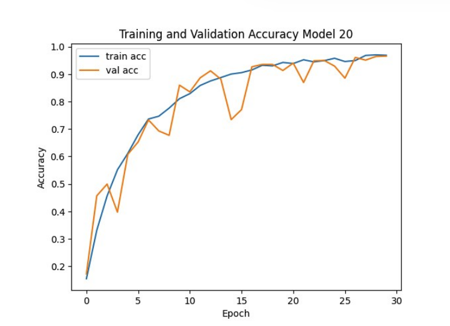

# Discriminative CNN for Multi-Class Object Recognition

## Project Overview
This project details the iterative design, development, and evaluation of 20 Convolutional Neural Network (CNN) models for classifying a 39-class image dataset (4,108 images). Starting from a simple 3-layer CNN, experiments were conducted to systematically optimize activation functions, pooling strategies, regularization, and other hyperparameters, culminating in a final model achieving **96.59% validation accuracy**.

## Dataset
- Total Images: 4,108
- Classes: 39 unique categories
- Split: 80% Training (3,287 images), 20% Validation (821 images)
- Preprocessing:
  - Images resized to 224×224 pixels
  - Pixel values normalized to [0, 1]
  - Class labels mapped for categorical cross-entropy

**Note:** Images are not included due to size, but should be structured in subfolders by class.

## Experimental Methodology
1. **Activation Functions & Epochs**: Tested ReLU, LeakyReLU, ELU, Swish; 30 epochs outperformed 20.
2. **Pooling Strategies**:
   - Flatten layer → parameter explosion, overfitting
   - AveragePooling → smoothed features, underperformed
   - GlobalAveragePooling (GAP) → optimal
3. **Regularization**:
   - Batch Normalization → stabilized gradients
   - Dropout (0.45–0.5) → reduced overfitting
4. **Optimizer Testing**: Adam showed best convergence; RMSprop slower and lower accuracy
5. **Final Architecture Enhancements**: Added an extra convolutional layer to improve feature extraction

## Final Model Architecture (Model 20)
- Input: 224×224×3
- Convolutional Layers: 32 → 64 → 128 → 128 filters, ReLU activations
- Batch Normalization after final conv layer
- Dropout: 0.45
- GlobalAveragePooling2D
- Dense output: 39 units, Softmax activation
- Optimizer: Adam (learning rate 1e-3)

**Performance**
- Training Accuracy: 96.57%
- Validation Accuracy: 96.59%
- Validation Loss: 0.1094
  

## Results
- Training and validation accuracy plot shows stable convergence and peak validation accuracy of 96.59%.
- The final model demonstrates strong generalization across all 39 classes.

  
## Technical Details & Future Work

- The CNN models were implemented using **TensorFlow** and **Keras** and trained on **Google Colab** with GPU acceleration.  
- Dataset images were mounted directly from **Google Drive** for efficient access.  
- While the final model achieves **96.59% validation accuracy**, performance could be further improved by:
  - Increasing dataset size with additional images per class.
  - Applying data augmentation techniques (e.g., rotations, flips, color jitter).
  - Experimenting with learning rate schedules or advanced optimizers.
 
